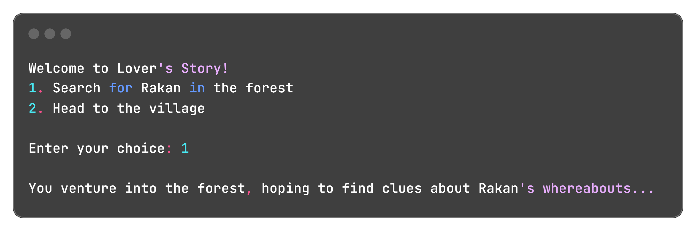

<h1 align="center">A League of Legends Interactive Narrative</h1>

An immersive, **text-based** interactive narrative set in the League of Legends universe, allowing players to experience a unique **storytelling** adventure through player-driven choices.

<h2 align="center">Table of Contents</h2>

- [Project Overview](#project-overview)
  - [What the Project Aims to Achieve](#what-the-project-aims-to-achieve)
  - [Project Goals](#project-goals)
  - [Key Features](#key-features)
- [Getting Started](#getting-started)
  - [Prerequisites](#prerequisites)
  - [Setup Instructions](#setup-instructions)
  - [Installation](#installation)
- [Story Creation Guide](story-creation-guide)
- [Features](#features)
  - [Examples](#examples)
- [Technical Requirements](#technical-requirements)
  - [Hardware Requirements](#software-requirements)
  - [Software Requirements](#software-requirements)
  - [Network Requirements](#software-requirements)
- [Technical Details](#technical-details)
  - [Architecture](#architecture)
  - [Project Structure](#project-structure)
  - [Libraries](#libraries)
- [Wiki](#wiki)
  - [Wiki Overview](#wiki-overview)
  - [Wiki Highlights](#wiki-highlights)
- [License and Copyright](#license-and-copyright)
  - [License](#license)
  - [Disclaimer](#disclaimer)
- [Contact and Support](#contact-and-support)
  - [Contact Information](#contact-information)
    - [About the Developer](#about-the-developer)
  - [Support Resources](#support-resources)
    - [FAQs](#faqs)
  ***

## Project Overview

### What the Project Aims to Achieve

This interactive story transports players into the world of **Xayah** and **Rakan**, two legendary characters from the League of Legends universe. Players step into the role of Xayah, embarking on a critical mission to rescue her soulmate, Rakan, from human captors.
The narrative is designed as a **Choose Your Own Adventure (CYOA)** experience, where each decision fundamentally alters the story's trajectory. Unlike traditional linear narratives, this game empowers players to shape the protagonist's journey through strategic choices, leading to multiple potential outcomes and endings.

### Project Goals

- Create an engaging, interactive storytelling experience
- Demonstrate the potential of narrative branching in game design
- Provide an accessible entry point into interactive storytelling
- Showcase **Python's** capabilities in creating dynamic narrative experiences

### Key Features

- Immersive text-based gameplay
- Multiple narrative branches and endings
- Player-driven storytelling
- Rich, character-driven narrative
- Simple, intuitive interface
- Replayability through different story paths

## Getting Started

### Prerequisites

- [Python](https://www.python.org/downloads/) 3.7 or higher
- [Git](https://git-scm.com/downloads)
- [Visual Studio (VS)](https://visualstudio.microsoft.com/downloads/)
- Basic understanding of Python
- A interactive story

### Setup Instructions

1. Ensure your prerequisites are installed on your system
2. Clone the repository
3. Navigate to the project directory
4. Run the Python script

### Instructions

- Clone the repository
  `git clone https://github.com/FizzyMo/lovers-story-CYOA.git`
- Navigate to project directory
  `cd lovers-story-CYOA`
- Run the game
  `python lovers-story-CYOA.py`

### Installation

No installation required besides the **prerequisites**.

## Features

- Interactive storytelling mechanic
- Dynamic narrative branching
- Player choice tracking
- Multiple narrative outcomes
- Minimal system resource requirements

### Examples

- Make choices that shape the destiny of Xayah and Rakan.
- Experience multiple endings based on your choices.
- Immerse yourself in the rich storytelling set in the League of Legends universe.



## Technical Requirements

### Software Requirements

- [Python](https://www.python.org/downloads/)
- [Visual Studio Code](https://visualstudio.microsoft.com/downloads/)

## Technical Details

### Architecture

The game is built using a simple text-based architecture, with a Python script that handles user input and provides the game logic.

### Project Structure

```
lovers-story/
├── lovers-story-CYOA.py
├── README.md
├── images              
│   └── example.png
└── LICENSE
```

The project consists of a single Python script `lovers-story-CYOA` that contains the game logic and a
README file that provides instructions and information about the game.

### Libraries

- **sys:** used to exit the program
- **time:** used for delays and pauses
- **os:** used to clear the terminal screen

## Wiki

### Wiki Overview

This [Wiki](https://github.com/FizzyMo/BeyondBackend.Python-Adventure/wiki) is your guide to **League of Legends Interactive Narrative** project. Explore behind-the-scenes insights into the development, narrative design, and technical details. Discover how the branching storylines are crafted, learn more about Xayah and Rakan's world, and find answers to frequently asked questions. Whether you're a player, a developer, or a storytelling enthusiast, this wiki offers valuable resources and a deeper understanding of the project.

### Wiki Highlights

- **Interactive Storytelling:** Shape Xayah's fate through meaningful choices, experiencing a unique adventure with every playthrough.
- **Multiple Endings:** Your decisions have real consequences, leading to a variety of satisfying (and sometimes heartbreaking) conclusions.
- **League of Legends Universe:** Immerse yourself in the rich lore of [Ionia](https://universe.leagueoflegends.com/en_US/region/ionia/) as you navigate familiar landscapes and encounter iconic characters.
- **Xayah and Rakan's Story:** Experience a captivating tale of love, loss, and resilience, inspired by the legendary [Vastaya](https://universe.leagueoflegends.com/en_US/race/vastaya/) duo.
- **Easy to Play:** Jump right into the action with a simple, text-based interface and intuitive gameplay.
- **Behind-the-Scenes:** Explore the [Wiki](https://github.com/FizzyMo/BeyondBackend.Python-Adventure/wiki) to learn about the project's development, narrative design philosophy, and technical details.
- **Community Resources:** Find answers to your questions in the FAQs and support resources.
- **Open Source Project:** Explore the code and learn how to create your own interactive narratives.

## License and Copyright

### License

* This project is licensed under [MIT License](https://github.com/FizzyMo/BeyondBackend.Python-Adventure/blob/master/LICENSE)
* Characters and universe owned by [Riot Games](https://www.riotgames.com/en)

### Disclaimer

This project is not affiliated with [Riot Games](https://www.riotgames.com/en) or [League of Legends](https://www.leagueoflegends.com/en-us/). All characters and assets are owned by Riot Games.

## Contact and Support

### Contact Information
carisa.dev@gmail.com
* **Social Media:**
    * **About the Developer:** Follow me on [Instagram](https://www.instagram.com/devsilencewritten/) for updates and insights into my projects and personal journey.
    * **Blog:** Check out my blog [Debugging My Code, Debugging My Life](https://beyondbackend.hashnode.dev/) for coding tips and personal development stories.

#### About the Developer

**Carisa Saenz-Videtto**

## Support Resources

### FAQs
1. **Q:** Do I need to be familiar with League of Legends to enjoy this interactive story?

    **A:** Not at all! While the story is set in the League of Legends universe and features familiar characters like **Xayah** and **Rakan**, it's designed to be enjoyable even for those who haven't played the game. The narrative stands on its own, focusing on a compelling story of love, loss, and resilience.

2. **Q:** What's your process when you hit a roadblock during development?

    **A:** For this interactive narrative the main challenge I faced in this project was the code stonewalling the storytelling. I realized I was working harder not smarter.

    I took a breather put on my creative writing hat and switched gears. I grabbed my trusty notebook and outlined the entire story, mapping out different choices and their outcomes. This gave me a much clearer vision. Next, in order to prevent doing the same work twice, I moved the draft to Word revising the story before ultimately merging it back into the code. Much smoother!

    My **"typical"** method for solving problems is: 

* **Take a Moment to Stop and Inhale:** I physically shut my eyes, inhale deeply a few times, and empty my mind. This is incredibly beneficial! 

* **Assess the Situation:** I use my project notebook to jot down what's **working**, what's **not**, and where I'm **headed**. It's like taking inventory of my progress. 

* **Analyze and separate:** I break down the issues into **smaller** more manageable parts. Breaking it down into smaller chunks can feel less overwhelming.  

  **Refer to Resources:** If I'm really stuck, I'll look for inspiration in other interactive narratives, games, or even books. Seeing how others approach similar challenges can spark new ideas.

3. **Q:** How long did it take to develop?

    **A:** This project is ongoing! The initial development phase took 2 weeks that I started in February, 2024 but I see it as an evolving passion project.